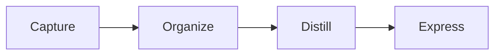

# Knowledge

Knowledge is a local-first Markdown knowledge system. It keeps permanent notes as plain files, serves them in the browser with Hugo, indexes them with SQLite FTS5, and provides a small terminal command named `kn` for daily note work.

The project has three local surfaces:

```text
http://127.0.0.1:1314/              Personal notes home and search
http://127.0.0.1:1314/productivity/ Productivity tools
http://127.0.0.1:1320/              Read-only documentation browser
```

Everything is designed around one rule: Markdown files are the source of truth. Runtime databases, generated Hugo configuration, visual render caches, and systemd units are disposable and can be rebuilt.

## Project Goal

Knowledge exists to be a stable, zero-cost personal knowledge environment built from native local tools. The goal is not to become a large custom platform. The goal is to connect the right simple tools in the right order so daily notes, large Markdown documentation sets, search, reading, visual rendering, and small productivity workflows all work locally without proprietary lock-in.

The project should stay boring, portable, and maintainable:

- Markdown files remain the permanent data.
- The application code stays in this repository.
- Personal notes stay outside this repository.
- Runtime state stays disposable.
- Browser pages are for reading and searching.
- Terminal commands are for deliberate note operations.
- Documentation browsing is read-only by design.
- New code is added only when it removes real manual work or replaces fragile manual steps.

## Current Features

- Local-first personal Markdown notes.
- Five fixed MOC folders: Inbox, Projects, Areas, Resources, and Archives.
- Browser home page with personal note statistics.
- Browser command search with `Alt + K`.
- SQLite FTS5 search for personal notes.
- SQLite FTS5 search for external documentation Markdown.
- Separate read-only documentation browser on port `1320`.
- Documentation indexer separated from the browser server.
- Documentation watcher service for refreshing the docs index.
- `kn` terminal command for opening, creating, reading, moving, and deleting personal notes.
- Global filename completion across all five personal note MOCs.
- Confirmation before move and delete operations.
- Read-only review before delete operations.
- Local-only Git history for personal notes.
- Protection against accidentally adding a remote to the personal notes Git repository.
- Hugo-based personal note rendering.
- Mermaid, D2, Typst, Canvas, and calendar visual blocks.
- Local productivity page with World Clock, Weather, Prayer, and Focus tools.
- systemd user services for the web server, search API, note watcher, docs browser, and docs watcher.
- Reproducible installer with smoke tests.
- Catppuccin Mocha based visual theme.

## What It Does

- Keeps personal notes in five fixed Markdown folders.
- Opens, creates, reads, moves, and deletes notes from the terminal with `kn`.
- Searches notes from the browser with SQLite FTS5.
- Serves personal notes with Hugo at `http://127.0.0.1:1314/`.
- Serves external documentation Markdown as a separate read-only browser at `http://127.0.0.1:1320/`.
- Renders Mermaid, D2, Typst, Canvas, and calendar blocks inside notes.
- Provides a local productivity page for clock, weather, prayer times, and focus timers.
- Uses systemd user services so everything starts and restarts locally.

## Repository Role

This GitHub repository stores the Knowledge application code only.

Personal Markdown notes live outside the project directory. The notes workspace is local-only and may have its own local Git history, but it must not have a remote.

The installed `kn` command at `~/.local/bin/kn` is only a symlink to this repository's `bin/kn`. The real source stays in the project directory.

## Personal Notes Workspace

A personal workspace must contain exactly five folders:

```text
Knowledge/
├── 0-Inbox/
├── 1-Projects/
├── 2-Areas/
├── 3-Resources/
└── 4-Archives/
```

Section meaning:

- `0-Inbox` captures new notes.
- `1-Projects` stores active project notes.
- `2-Areas` stores ongoing responsibilities and interests.
- `3-Resources` stores reference material.
- `4-Archives` stores inactive or completed notes.

Only Markdown files belong in these folders. The folder decides the MOC; front matter does not duplicate MOC state.

## Filename Rules

Personal note filenames must match this pattern:

```text
^[a-z0-9]+(?:-[a-z0-9]+)*\.md$
```

Valid examples:

```text
linux.md
arch-linux.md
building-second-brain.md
note1.md
project-2026.md
```

Invalid examples:

```text
Linux.md
note_name.md
note name.md
note.md.md
note
-note.md
note-.md
note--name.md
```

Filenames are globally unique across all five MOCs.

## Front Matter

New notes use this shape:

```yaml
---
title:
description:
status:
aliases: []
tags: []
---
```

Supported `status` values are free text, but the UI is prepared for:

```text
todo
in-progress
review
done
```

## Install

Configure the notes workspace in:

```text
~/.config/knowledge/workspaces.toml
```

Example:

```toml
[[workspace]]
root = "/home/murat/Media/5-Documentation/Knowledge"
```

Then run:

```bash
cd /home/murat/Media/6-Project/knowledge
./install.sh
```

The installer:

- installs npm dependencies with `npm ci`;
- generates runtime Hugo config under `.runtime/personal/`;
- builds the personal note index;
- builds the documentation browser index;
- links `~/.local/bin/kn` to `bin/kn`;
- links Bash completion;
- installs and restarts systemd user services;
- runs the smoke test.

## Services

The installer manages these user services:

```text
knowledge-personal-search.service   Bun API for personal notes
knowledge-personal-web.service      Hugo web server on port 1314
knowledge-personal-watch.service    inotify-based personal note index sync
knowledge-docs-browser.service      read-only docs browser on port 1320
knowledge-docs-watch.service        documentation index refresh watcher
```

Useful checks:

```bash
systemctl --user status knowledge-personal-search.service
systemctl --user status knowledge-personal-web.service
systemctl --user status knowledge-docs-browser.service
systemctl --user status knowledge-docs-watch.service
```

## KN Command

Use `kn` for personal notes.

Open or create a note:

```bash
kn nvim inbox note-name.md
kn code projects project-note.md
kn hx resources linux-notes.md
```

The `.md` suffix is optional for open/create:

```bash
kn nvim inbox note-name
```

Interactive usage:

```bash
kn nvim
kn nvim inbox
```

Read a note in the terminal:

```bash
kn glow note-name.md
```

Move a note between MOCs:

```bash
kn mv note-name.md archives
```

Delete a note:

```bash
kn rm note-name.md
```

Move and delete ask for confirmation. Delete opens the note read-only first for review.

## Global Filename Selection

All five MOC folders are treated as one filename pool.

- `kn glow`, `kn rm`, `kn mv`, and editor open/create use the same global filename completion.
- Empty filename completion returns the last used note if it still exists.
- Typed filename completion searches all five MOCs and returns up to 20 results.
- Existing notes always open from their real location.
- The MOC argument only decides where a new note is created.

## Browser Search

Personal notes are searched at:

```text
http://127.0.0.1:1314/
```

Use `Alt + K` to open search. Search returns clickable note results. Filters are available for folder, filename, title, description, status, alias, and tag.

The home page intentionally shows only note statistics and links to the three local surfaces.

## Documentation Browser

External Markdown documentation is served at:

```text
http://127.0.0.1:1320/
```

By default it scans:

```text
/home/murat/Media/5-Documentation
```

and ignores the personal Knowledge workspace:

```text
/home/murat/Media/5-Documentation/Knowledge
```

The documentation browser is read-only. It supports search and reading only. Create, edit, move, and delete operations are rejected by the server.

The documentation index is built by:

```bash
bun scripts/build-docs-index.ts
```

and refreshed by:

```text
knowledge-docs-watch.service
```

## Productivity

The productivity page is separate from the Markdown knowledge system:

```text
http://127.0.0.1:1314/productivity/
```

It includes:

- World Clock
- Weather
- Prayer Times
- Focus

State is stored in browser storage. Weather and city lookup use Open-Meteo. Prayer times use AlAdhan with the Diyanet calculation method. The productivity page does not read, write, move, delete, or index Markdown notes.

## Visual Blocks

Markdown notes can contain visual fenced code blocks.

Mermaid:

````markdown

````

D2:

````markdown
```d2
client -> api
api -> database
```
````

Typst:

````markdown
```typst
#set page(width: auto, height: auto)
Hello from Typst
```
````

Calendar:

````markdown
```calendar
src: /absolute/path/to/calendar.ics
view: week
```
````

## Local Checks

Run the full installer and smoke test:

```bash
./install.sh
```

Run smoke directly:

```bash
tests/smoke.sh
```

Check docs health:

```bash
curl -fsS http://127.0.0.1:1320/health
```

Check personal search:

```bash
curl -fsS 'http://127.0.0.1:8788/api/search?q=linux'
```

Check docs search:

```bash
curl -fsS 'http://127.0.0.1:1320/api/search?q=markdown'
```

## Architecture

```text
Personal Markdown workspace
        │
        ├── inotify watcher
        │       └── incremental SQLite FTS5 index
        │
        ├── Hugo web server
        │       └── browser UI on 1314
        │
        └── kn terminal command

External documentation Markdown
        │
        ├── docs indexer / docs watcher
        │       └── SQLite FTS5 docs index
        │
        └── read-only docs browser on 1320
```

Permanent data stays in Markdown files. Runtime data stays under `.runtime/` and can be rebuilt.

## Maintenance Rule

Prefer native local tools over custom infrastructure:

- Hugo for note pages
- SQLite FTS5 for search
- Bun for small local APIs and indexers
- systemd user services for process management
- inotify for filesystem change detection
- Git for source control and local note history

Do not add a database or service unless it replaces real complexity.
