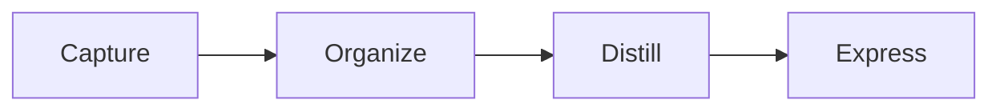

# Knowledge

A local-first, Markdown-first Second Brain system built around plain files, Hugo, SQLite FTS5, Bun, and a small set of text-based visual renderers.

The core idea is simple:

> Your notes are Markdown files. Everything else is replaceable infrastructure.

Knowledge does not store notes in a proprietary database. The filesystem is the source of truth, while search indexes, rendered diagrams, runtime files, and caches are derived data that can be rebuilt.

## Design Goals

- Plain Markdown as the permanent knowledge format
- Local-first and application-independent
- No plugin ecosystem required
- No proprietary note database
- Incremental indexing instead of filesystem-wide rescans
- Fast browser-based reading and search
- Portable command-line workflow
- Reproducible installation
- Minimal maintenance
- Disposable runtime state
- Git-friendly source code
- Long-term data ownership

## Knowledge Structure

A workspace contains exactly five MOC directories:

```text
Knowledge/
├── 0-Inbox/
├── 1-Projects/
├── 2-Areas/
├── 3-Resources/
└── 4-Archives/
````

Only Markdown files belong inside these directories.

The five sections follow an Inbox + PARA-style organization model:

* `Inbox` — captured notes waiting to be organized
* `Projects` — active outcomes and projects
* `Areas` — ongoing responsibilities and interests
* `Resources` — reference material
* `Archives` — inactive or completed material

Notes can move between these sections without changing their identity.

## Source of Truth

The permanent data model is intentionally small:

```text
Markdown files
+
filesystem location
+
front matter
+
links
```

SQLite is not the source of truth.

Rendered SVG files are not the source of truth.

Hugo output is not the source of truth.

Runtime configuration is not the source of truth.

All of those can be rebuilt from the Markdown workspace.

## Canonical Front Matter

New notes use the following template:

```yaml
---
title:
description:
status:
aliases: []
tags: []
---
```

MOC information is not duplicated in front matter.

The physical directory determines whether a note belongs to Inbox, Projects, Areas, Resources, or Archives.

## Filename Contract

Markdown filenames follow one strict rule:

```text
^[a-z]+(?:-[a-z]+)*\.md$
```

Examples:

```text
linux.md
arch-linux.md
building-second-brain.md
```

Rejected examples:

```text
Linux.md
note1.md
note_name.md
note name.md
note.md.md
note
-note.md
note-.md
note--name.md
```

Rules:

* lowercase English letters only
* hyphen is the only separator
* no numbers
* no spaces
* no underscores
* exactly one `.md` suffix
* filenames are globally unique across all five MOCs

## Architecture

```text
Markdown workspace
        │
        ▼
Filesystem events
        │
        ▼
Incremental indexer
        │
        ▼
SQLite FTS5
        │
        ▼
Bun / TypeScript API
        │
        ├── Search
        ├── Completion
        ├── Last note
        ├── D2 rendering
        └── Typst rendering
        │
        ▼
Hugo
        │
        ▼
Browser
```

The live filesystem watcher processes individual file events.

Create, edit, delete, and move operations do not require a complete workspace rescan.

## Technology Stack

### Core

* Markdown — permanent note format
* Hugo — web rendering
* Goldmark — Markdown rendering through Hugo
* Bun — TypeScript runtime
* TypeScript — indexing, runtime API, workspace logic, note creation
* SQLite FTS5 — search index
* Bash — watcher and command-line integration
* systemd user services — process management
* inotify — filesystem event monitoring

### Browser

* JavaScript
* HTML
* CSS

### Visual Languages

* Mermaid
* D2
* Typst

These visual languages live inside Markdown fenced code blocks.

The Markdown file remains the source of truth.

## Visual Notes

A single Markdown note can contain normal prose and rendered visual blocks.

### Mermaid

````markdown

````

Mermaid renders in the browser.

### D2

````markdown
```d2
client -> api
api -> database
api -> cache
```
````

D2 is rendered through the local API and cached as SVG.

### Typst

````markdown
```typst
#set page(
  width: auto,
  height: auto,
  margin: 12pt,
)

#rect(
  inset: 12pt,
  stroke: 1pt,
)[
  Visual note
]
```
````

Typst is rendered through the local API and cached as SVG.

Generated D2 and Typst SVG files live under runtime cache and are disposable.

## External Assets

The Knowledge workspace remains Markdown-only.

Images, PDFs, audio files, videos, and other binary assets may live elsewhere on the filesystem and be exposed to Hugo through static mounts.

Markdown can then reference them normally.

Example image:

```markdown

```

Example PDF:

```markdown
[Open PDF](/assets/pdf/manual.pdf)
```

This avoids duplicating binary files inside the note workspace.

## Search

The local search API uses SQLite FTS5.

Global Search accepts normal text queries.

Structured filters are available for:

* folder
* filename
* title
* description
* status
* alias
* tag

## Shell Command

The `kn` command provides the normal daily workflow.

### Open or Create

```bash
kn code inbox note-name.md
kn zed projects project-note.md
kn hx resources linux.md
kn nvim areas-language-note.md
```

The filename must satisfy the filename contract.

If the note already exists globally, it is opened from its existing MOC.

If it does not exist, it is created in the requested MOC.

### Read with Glow

```bash
kn glow note-name.md
```

Glow is used as a terminal Markdown reader.

The configured editor can be launched from Glow when needed.

### Move Between MOCs

```bash
kn mv note-name.md archives
```

Example:

```text
projects → archives
```

The command shows the source and destination and asks for confirmation before moving.

This is a real filesystem move, not a copy.

The watcher then updates the index and web route automatically.

### Delete

```bash
kn rm note-name.md
```

Deletion requires confirmation.

## Shell Completion

Bash completion is installed for `kn`.

Completion behavior is intentionally bounded:

```text
empty completion → last used note
typed completion → maximum 5 indexed filename matches
deleted note     → never shown
filesystem scan  → never used for completion
```

This keeps completion usable even with very large note collections.

## Browser

The browser interface provides:

* rendered Markdown
* search
* note preview
* backlinks
* related notes
* previous and next navigation
* table of contents
* reading progress
* copy-link support
* keyboard shortcuts
* workspace statistics
* Mermaid rendering
* D2 rendering
* Typst rendering

## Runtime Services

The system uses three systemd user services:

```text
knowledge-personal-search.service
knowledge-personal-watch.service
knowledge-personal-web.service
```

### Search

Runs the Bun / TypeScript API and SQLite search layer.

### Watch

Listens for Markdown filesystem events and performs incremental upsert/delete synchronization.

### Web

Runs the local Hugo server.

Default local endpoints:

```text
Web: http://127.0.0.1:1314
API: http://127.0.0.1:8788
```

## Installation

### Requirements

The installer expects the following commands to be available:

```text
bun
hugo
node
npm
d2
typst
inotifywait
curl
systemctl
```

The system is designed for Linux with systemd user services.

### Clone

```bash
git clone <repository-url>
cd knowledge
```

### Configure Workspace

Create the local workspace configuration:

```bash
cp workspace.example.toml workspace.toml
```

Edit:

```toml
[[workspace]]
root = "/absolute/path/to/your/notes"
```

The configured directory must contain:

```text
0-Inbox
1-Projects
2-Areas
3-Resources
4-Archives
```

`workspace.toml` is machine-specific and is not committed.

### Install

```bash
./install.sh
```

The installer:

* checks required external commands
* installs npm dependencies with `npm ci`
* generates runtime configuration
* builds the initial SQLite index
* installs `kn`
* installs Bash completion
* generates systemd user units using the actual installation paths
* starts the services
* runs the smoke test

A successful installation ends with:

```text
===== SMOKE TEST PASS =====
===== INSTALL PASS =====
```

## Generated and Local State

The following are intentionally excluded from Git:

```text
node_modules/
.runtime/
.search/
public/
workspace.toml
```

Runtime state includes:

```text
.runtime/
├── personal/
│   ├── hugo.toml
│   ├── knowledge.db
│   └── runtime.env
└── visual-cache/
```

These files are derived and can be regenerated.

## Testing

Run the complete smoke test:

```bash
tests/smoke.sh
```

The test suite verifies important invariants including:

* systemd services
* Hugo availability
* search API
* static assets
* D2 to SVG rendering
* Typst to SVG rendering
* global filename uniqueness
* fixed MOC membership
* Markdown-only workspace rules
* workspace configuration
* internal Markdown links
* watcher shell syntax
* visual renderer JavaScript syntax
* core TypeScript compilation

## Repository Layout

```text
.
├── bin/
│   └── kn
├── completions/
│   └── kn.bash
├── layouts/
├── scripts/
├── static/
│   ├── css/
│   └── js/
│       └── vendor/
├── systemd/
│   ├── knowledge-personal-search.service.in
│   ├── knowledge-personal-watch.service.in
│   └── knowledge-personal-web.service.in
├── tests/
│   └── smoke.sh
├── .gitignore
├── hugo.toml
├── install.sh
├── package.json
├── package-lock.json
└── workspace.example.toml
```

## Principles

Knowledge intentionally avoids:

* proprietary note databases
* mandatory editor plugins
* application-specific note formats
* filesystem-wide scans during normal operation
* duplicated MOC metadata
* duplicated binary attachments
* generated render output as permanent data
* heavy graph or canvas application layers
* unnecessary background services

The goal is not to replace Markdown.

The goal is to keep Markdown permanent while making it fast to search, navigate, read, and visually enrich.

## License


